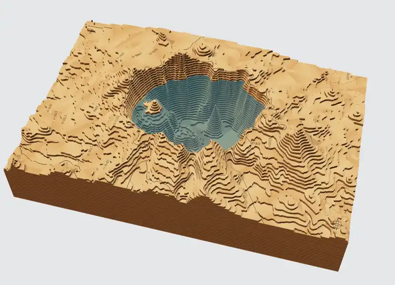

# TopoStack

Turn a place you love into something you can make. TopoStack is a free, browser-based terrain studio for creating layered, laser-cut reliefs and flat topographic engravings from real elevation and map data. No account, no install: pick a place, set your material, and download cut-ready SVGs.

[Visit the website](https://topostack.app) · [Open the studio](https://topostack.app/studio) · [Browse examples](https://topostack.app/examples) · [Find a lake with depth data](https://topostack.app/lakes) · [Report a bug or share an idea](https://github.com/Echo-Foxtrot-Works/topostack/issues)

*Software preview from the studio's 3D view, not a photo of a finished piece.*

## What you can make

| Workflow | Controls | Output |
| --- | --- | --- |
| **Layered relief** | Physical size, material thickness, vertical exaggeration, map details, and fabrication settings, including an optional machine work area | Master SVG, cut panels (one per work-area tile when split), matching engraving panels, optional paint templates, and an assembly guide |
| **Flat engraving** | Physical size, contour density, index contours, linework, map details, and border | One SVG at physical size, containing engraving paths only |

Both workflows support rectangular and circular crops; roads, trails, transportation labels, water outlines and fill patterns; state/province boundaries; latitude/longitude grids; elevation labels; a compass; and a scale bar. Add custom coordinate-based markers, trails, and boundaries to make a map your own.

Layered projects also support surveyed and modeled lake depth, alignment guides, and material reuse. Models larger than your laser bed can be split along a staggered seam grid into pieces that fit it; covered seams are cut as interlocking puzzle tabs, and each piece engraves an assembly id such as `L03-B2` where the next layer hides it. Sheet count is calculated from terrain relief, map scale, vertical exaggeration, and material thickness. Preview a project on the map, as 2D cut layers, as an engraving, or as a stacked/exploded 3D model, depending on the output type.

### Inside the studio

Crater Lake with USGS surveyed lake-floor data where available; existing terrain or modeled depths fill gaps. Depth is exaggerated for display.

*The bundled Crater Lake preview in the studio's 3D stack view. Generate fresh terrain before exporting fabrication files.*

### Get started

1. Open the [studio](https://topostack.app/studio) and explore the bundled Crater Lake preview.
2. Choose a place, frame the map area, and select **Layered** or **Flat** output.
3. Set the physical dimensions and details, then **Generate terrain** and inspect the result.
4. Open **Export** to download the complete project, individual artwork, or project settings.

The initial preview uses a bundled snapshot of real terrain and map data. Generate fresh terrain before fabrication export. SVGs use physical millimeter coordinates; layered artwork separates red cuts (`#FE0002`) and blue score/engraving paths (`#2366FF`), with named operation groups. Exports include project metadata and source attribution. Review the artwork and machine settings in your laser software before making a piece.

Project settings are saved in your browser's IndexedDB. Export a project-settings JSON backup to keep a copy or move to another device; import it using the studio's import control. Restored or imported projects need fresh terrain generation before fabrication export. Settings backups are available even when fabrication export is blocked.

The homepage lives at `/`, the editor at `/studio`, and the former `/about` URL redirects to `/`. TopoStack also supports the Atomm export lifecycle and **Open in Studio** integration.

### Examples and guides

Worked projects with renders, measured results and a project file you can import: [Grand Canyon](https://topostack.app/examples/grand-canyon), [Yosemite Valley](https://topostack.app/examples/yosemite-valley), [Mount Rainier](https://topostack.app/examples/mount-rainier), [Mount Fuji](https://topostack.app/examples/mount-fuji), [Matterhorn](https://topostack.app/examples/matterhorn), [Lake Tahoe](https://topostack.app/examples/lake-tahoe) and [Crater Lake](https://topostack.app/examples/crater-lake).

Step-by-step guides cover [making a layered laser-cut map](https://topostack.app/guides/laser-cut-topographic-map), [flat engraving](https://topostack.app/guides/topographic-map-engraving), [splitting maps larger than your laser bed](https://topostack.app/guides/split-large-maps), [painting water](https://topostack.app/guides/water-paint-templates) and [tracing a lake depth chart](https://topostack.app/guides/trace-a-depth-chart). The [lake directory](https://topostack.app/lakes) lists more than 8,000 lakes with surveyed or charted depths.

## Built in the open, with AI

TopoStack is a solo developer's spare-time project under [Echo Foxtrot Works](https://github.com/Echo-Foxtrot-Works), unashamedly built with help from AI. That collaboration helps turn ideas into working software and make the most of the time available.

Explore the code, ask questions, suggest improvements, or contribute through [GitHub](https://github.com/Echo-Foxtrot-Works/topostack). For bugs, include the output type, selected location, reproduction steps, and browser details; a project-settings JSON file can help reproduce geometry problems. For code changes, explain the behavior you changed and how you verified it. Pull requests normally target `dev`; releases are promoted to `main`.

[Donations](https://www.paypal.com/donate/?hosted_button_id=QXCUQVC3XAEZA) help support development and are always optional. Every export is available without donating.

## Feedback

Use **Feedback** in the studio or page footer to report bugs, request features, or flag low-quality terrain and lake data. Optionally include reviewable location and source diagnostics. Reports open as prefilled GitHub issues; a GitHub account and submission on GitHub are required. See the [feedback workflow and triage guide](docs/feedback.md).

## Contributing

Bug reports, data-quality reports and pull requests are welcome. Start with [CONTRIBUTING.md](CONTRIBUTING.md); [docs/development.md](docs/development.md) covers running the studio and map API locally, validation, releases, the Atomm package and data provisioning. The [documentation index](docs/README.md) lists every design reference and runbook, starting with the [architecture](docs/architecture.md). Everyone taking part follows the [code of conduct](CODE_OF_CONDUCT.md).

## License

TopoStack software is available under the [MIT License](LICENSE). Dependency and map-data licenses remain separate; retain the source attribution included with exports.

Sheet nesting uses [sparrow](https://github.com/JeroenGar/sparrow) (MIT, © 2025 Jeroen Gardeyn, KU Leuven) and [jagua-rs](https://github.com/JeroenGar/jagua-rs) (MPL-2.0), unmodified and compiled to WebAssembly. See [THIRD_PARTY_NOTICES.md](THIRD_PARTY_NOTICES.md) and [docs/nesting.md](docs/nesting.md) for licences and citations.
