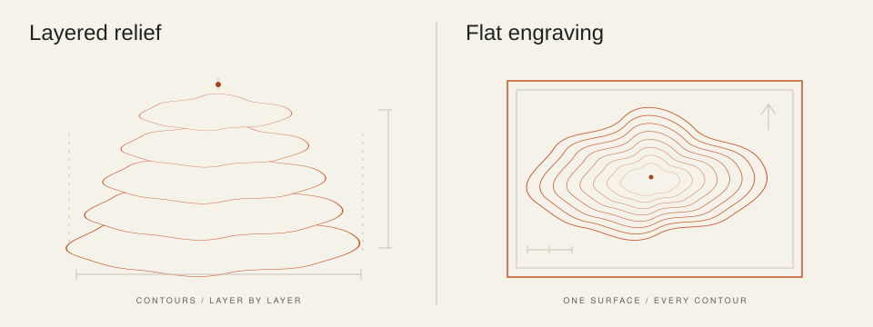
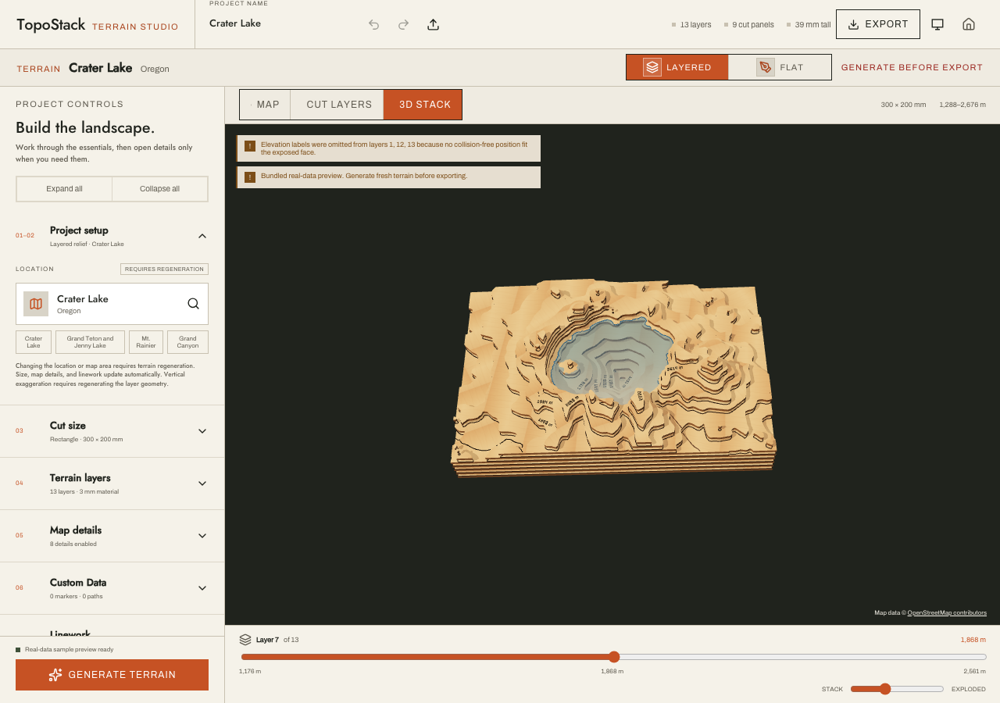

# TopoStack

Turn a place you love into something you can make. TopoStack is a browser-based terrain studio for creating layered, laser-cut reliefs and flat topographic engravings from real elevation and map data.

[Visit the website](https://topostack.app) · [Open the studio](https://topostack.app/studio) · [Report a bug or share an idea](https://github.com/Echo-Foxtrot-Works/topostack/issues)



## What you can make

| Workflow | Controls | Output |
| --- | --- | --- |
| **Layered relief** | Physical size, material thickness, vertical exaggeration, map details, and fabrication settings, including an optional machine work area | Master SVG, cut panels (one per work-area tile when split), matching engraving panels, optional paint templates, and an assembly guide |
| **Flat engraving** | Physical size, contour density, index contours, linework, map details, and border | One SVG at physical size, containing engraving paths only |

Both workflows support rectangular and circular crops; roads, trails, transportation labels, water outlines and fill patterns; state/province boundaries; latitude/longitude grids; elevation labels; a compass; and a scale bar. Add custom coordinate-based markers, trails, and boundaries to make a map your own.

Layered projects also support surveyed and modeled lake depth, alignment guides, and material reuse. Models larger than your laser bed can be split along a staggered seam grid into pieces that fit it; covered seams are cut as interlocking puzzle tabs, and each piece engraves an assembly id such as `L03-B2` where the next layer hides it. Sheet count is calculated from terrain relief, map scale, vertical exaggeration, and material thickness. Preview a project on the map, as 2D cut layers, as an engraving, or as a stacked/exploded 3D model, depending on the output type.

### Inside the studio



Crater Lake with USGS surveyed lake-floor data where available; existing terrain or modeled depths fill gaps. Depth is exaggerated for display.

*The bundled Crater Lake preview in the studio's 3D stack view. Generate fresh terrain before exporting fabrication files.*

### Get started

1. Open the [studio](https://topostack.app/studio) and explore the bundled Crater Lake preview.
2. Choose a place, frame the map area, and select **Layered** or **Flat** output.
3. Set the physical dimensions and details, then **Generate terrain** and inspect the result.
4. Open **Export** to download the complete project, individual artwork, or project settings.

The initial preview uses a bundled snapshot of real terrain and map data. Generate fresh terrain before fabrication export. SVGs use physical millimeter coordinates; layered artwork separates red cuts (`#FE0002`) and blue score/engraving paths (`#2366FF`), with named operation groups. Exports include project metadata and source attribution. Review the artwork and machine settings in your laser software before making a piece.

Project settings are saved in your browser's IndexedDB. Export a project-settings JSON backup to keep a copy or move to another device; import it using the studio's import control. Restored or imported projects need fresh terrain generation before fabrication export. Settings backups are available even when fabrication export is blocked.

The homepage lives at `/`, the editor at `/studio`, and the former `/about` URL redirects to `/`. TopoStack also supports the Atomm export lifecycle and **Open in Studio** integration.

## Built in the open, with AI

TopoStack is a solo developer's spare-time project under [Echo Foxtrot Works](https://github.com/Echo-Foxtrot-Works), unashamedly built with help from AI. That collaboration helps turn ideas into working software and make the most of the time available.

Explore the code, ask questions, suggest improvements, or contribute through [GitHub](https://github.com/Echo-Foxtrot-Works/topostack). For bugs, include the output type, selected location, reproduction steps, and browser details; a project-settings JSON file can help reproduce geometry problems. For code changes, explain the behavior you changed and how you verified it. Pull requests normally target `dev`; releases are promoted to `main`.

[Donations](https://www.paypal.com/donate/?hosted_button_id=QXCUQVC3XAEZA) help support development and are always optional. Every export is available without donating.

## Feedback

Use **Feedback** in the studio or page footer to report bugs, request features, or flag low-quality terrain and lake data. Optionally include reviewable location and source diagnostics. Reports open as prefilled GitHub issues; a GitHub account and submission on GitHub are required. See the [feedback workflow and triage guide](docs/feedback.md).

## Local development

### Install

Use the Node version in [`.nvmrc`](.nvmrc), currently **22.22.2**, to match CI. The supported runtime ranges are declared in [`package.json`](package.json).

```sh
git clone https://github.com/Echo-Foxtrot-Works/topostack.git
cd topostack
nvm install
nvm use
npm ci
```

If you use another Node version manager, select the version from `.nvmrc` before installing dependencies. Run the following commands from the repository root.

### Frontend and bundled preview

```sh
npm run dev:web
```

Open the URL printed by Vite, normally [localhost:5273](http://localhost:5273). This is enough to work on the homepage, studio UI, and bundled preview without Cloudflare credentials. Live place search and generation require a reachable map API. If terrain loading fails, the studio can display synthetic fallback terrain, but fabrication export remains blocked.

### Frontend and local map API

```sh
npm run dev
```

This starts the API, waits for `/health`, then starts Vite. The default ports are **8787** for the API and **5273** for the frontend. The launcher tries the next available ports when a default is busy and connects the frontend to the chosen API port.

The local Worker simulates terrain-cache storage but reads the provisioned vector and lake archives from the remote development R2 bucket. Full data access therefore requires Wrangler authentication and access to those Cloudflare resources. For your own deployment, follow the [map API setup guide](workers/map-api/README.md) and [data setup](#data-sources-and-provisioning) below.

Place search additionally needs a Geoapify key:

```sh
cp workers/map-api/.dev.vars.example workers/map-api/.dev.vars
```

Set `GEOCODER_API_KEY` in that local file. The geocoder key is not required to fetch elevation for known coordinates. `.dev.vars` is ignored by Git.

### Configuration

| Variable | Purpose |
| --- | --- |
| `TOPOSTACK_WEB_PORT` | Frontend port; defaults to `5273` |
| `VITE_MAP_API_PORT` | Local API port; defaults to `8787` |
| `VITE_MAP_API_URL` | Explicit API origin; overrides the local API URL. Use a reachable deployment that permits your frontend origin. |
| `VITE_SITE_ENV` | Set in the shell/CI build environment: `production` for the production custom domain; `development` (default) or `atomm` exclude the build from indexing. |
| `VITE_DONATION_URL` | Optional donation destination; defaults to the TopoStack PayPal page |
| `GEOCODER_API_KEY` | Worker-only Geoapify credential; keep it in `.dev.vars` locally or a deployment secret |

Pass port overrides in the shell:

```sh
VITE_MAP_API_PORT=8799 TOPOSTACK_WEB_PORT=5299 npm run dev
```

Explicitly selected busy ports cause an error. The individual `dev:web` and `dev:api` commands honor their port variables but do not search for a free port. Set frontend API/donation overrides in `apps/generator/.env` or the shell; `VITE_` values are included in the browser build and must not contain secrets.

## Repository layout

| Path | Responsibility |
| --- | --- |
| [`apps/generator`](apps/generator) | Svelte 5/SvelteKit homepage and studio, previews, browser storage, downloads, and Atomm integration |
| [`packages/core`](packages/core) | Portable TypeScript geometry engine, fabrication planning, and SVG generation |
| [`packages/data-contracts`](packages/data-contracts) | Source-only contracts shared by the studio, the Worker, and scripts: catalog validation, archive releases, terrain PNG decoding, usage events |
| [`workers/map-api`](workers/map-api) | Cloudflare Worker for terrain, map archives, geocoding, caching, and readiness checks |
| [`e2e`](e2e) | Deterministic Playwright tests for navigation, previews, generation, and exports |
| [`e2e-live`](e2e-live) | Browser canary that generates and exports against a deployed API |
| [`scripts`](scripts/README.md) | Build steps, data builders, provisioning, verification, and release tooling, grouped by purpose; the README lists how each is run |
| [`atomm`](atomm) | Platform listing and cover artwork |
| [`docs`](docs) | Architecture, fabrication details, and operational runbooks |

Terrain geometry is calculated in the browser, with expensive work delegated to a Web Worker. The API streams and caches source data. MapLibre supplies the interactive reference map, and Three.js renders the 3D preview. See [architecture](docs/architecture.md) for the geometry pipeline and coordinate conventions.

## Validation

```sh
npm run lint
npm run typecheck
npm test
npm run build
npm run budget:web
```

`npm run build` builds all workspaces, including a dry run of the Worker deployment; it does not publish the app. The generated frontend is in `apps/generator/dist`. `npm run budget:web` checks that built output against the homepage, studio preload, and default-preview startup budgets plus HTML limits, and reports total JavaScript and CSS without enforcing them.

The Python data builders under `scripts/` have their own tests, kept out of `npm test` so Node-only contributors need no GDAL stack. CI runs them on Python 3.13. Locally, use a virtual environment with the pinned builder dependencies:

```sh
python3.13 -m venv .venv-data && . .venv-data/bin/activate
pip install -r scripts/data-build/requirements.txt
npm run test:python
```

Install browsers before running the end-to-end suite:

```sh
npx playwright install chromium firefox webkit
npm run test:e2e
```

To run Firefox alone:

```sh
npm run test:e2e -- --project=firefox
```

On macOS, the Playwright configuration stores Firefox startup metadata in
`node_modules/.cache/topostack/firefox-app-data`. This avoids the
[macOS 27 profile-launch issue](https://bugzilla.mozilla.org/show_bug.cgi?id=2060476)
while keeping test data separate from your personal Firefox data. Playwright still
creates a fresh browser profile for each launch.

The browser suite builds its own deterministic test version and covers Chromium, Firefox, and WebKit. CI runs each browser on a separate runner, with one test worker per runner. Each runner installs only its selected browser; all three must pass the aggregate `Browser E2E` check before deployment. Failed runs retain browser-specific diagnostics for seven days. Dependency installation skips the implicit npm audit because CI audits explicitly: the deployment gate fails on high-severity production advisories, and a separate non-blocking job reports the full audit. `npm run test:coverage` runs the unit/component/Worker suites with the thresholds used in CI. Run the live browser canary against a deployed environment with:

```sh
PUBLIC_APP_URL=https://dev.topostack.app npm run test:e2e:live
```

If local lint reports files under `.wrangler/tmp`, exclude those generated files with `npx eslint . --max-warnings=0 --ignore-pattern '**/.wrangler/**'`. CI uses a clean checkout.

## Deployment and releases

### Application and Atomm versions

TopoStack has one SemVer version, sourced from the root `package.json` and synchronized across all workspaces, their lockfile entries, and `atomm/version.json`. The web app and the Atomm package release together under that version; `npm run version:check` fails if any of them disagree. Dataset identifiers and project-file schema versions remain separate. (Before 0.2.0 the Atomm package had its own version line, which ended at `atomm-v0.1.2`.)

```sh
npm run version:check
```

The main version is released from the changelog; see [docs/changelog.md](docs/changelog.md). Each user-facing pull request adds a fragment under `changelog/unreleased/`. When `dev` is proposed for `main`, a workflow folds the fragments into `changelog/releases.json`, bumps every workspace manifest and the lockfile by the largest change (breaking → major, feature → minor, otherwise patch), and pushes a `Release vX.Y.Z` commit to `dev`. CI rejects mismatched versions and a changelog that disagrees with the package version. A change that only affects the Atomm package still goes through a fragment and a release, so both channels keep the same number.

Every frontend build includes `version.json` with the main version, source commit, environment, and dirty-tree flag; Atomm ZIPs additionally include `atommVersion`, which equals `version`. Read `/version.json` on a deployed site or extract it from the ZIP to identify a build. Source-only builds without Git report null source metadata. Atomm release receipts record the version, and publishing requires the tag to match it.

Each release gets two tags on the same commit: `v<version>` for the web app and `atomm-v<version>` for the Atomm package. After production deploys, CI's `Tag release` job tags `v<version>` and publishes a GitHub release with that version's changelog. When the whole production run succeeds, [Publish Atomm release](.github/workflows/release-atomm.yml) publishes that run's verified package as `atomm-v<version>`, with the changelog since the previous Atomm release, and marks it Latest so the downloadable package stays at the top of the Releases page. Both skip versions that are already released. Existing release tags must never be moved or reused; release again for another version.


[GitHub Actions](.github/workflows/ci.yml) validates pull requests targeting `dev` or `main`. Successful pushes to those branches, or manual runs on them, deploy the matching environment after quality, build, and browser checks pass.

| Branch | GitHub environment | Worker | Website |
| --- | --- | --- | --- |
| `dev` | `development` | `topostack-dev` | [Development](https://dev.topostack.app) |
| `main` | `production` | `topostack` | [Production](https://topostack.app) |

Each Worker serves the static frontend and `/v1/*` API, with `/health` for liveness and `/ready` for data/geocoder readiness. Configure these secrets separately in **both** GitHub environments:

- `CLOUDFLARE_ACCOUNT_ID`
- `CLOUDFLARE_API_TOKEN`
- `GEOCODER_API_KEY`

Restrict `development` deployments to `dev` and `production` to `main`. Configure any production reviewer gate to work with your maintainer team. Pull-request validation does not reference deployment environments; only the deployment job receives their secrets. See the [Worker guide](workers/map-api/README.md) for resource configuration and token permissions.

The [hourly production monitor](.github/workflows/production-monitor.yml) checks the frontend, API, and data-serving paths. The [daily browser monitor](.github/workflows/production-browser-monitor.yml) generates real terrain and inspects a downloaded fabrication package. Use the [release acceptance and rollback runbook](docs/release-acceptance.md) for platform, physical fabrication, and recovery checks.

### Atomm

[Atomm](https://www.atomm.com) is xTool's marketplace of community generators. TopoStack is published there as a second distribution channel: the same studio, built with `VITE_SITE_ENV=atomm`, embedded in the platform's layout with its export lifecycle. The `atomm/` directory holds the listing copy and artwork, and `scripts/release/` packages the bundle.

To preview the local studio in Atomm, use the running frontend URL as its `local` parameter. With the default port:

```text
https://www.atomm.com/creativetools/community/generator/topostack?local=http://localhost:5273/studio
```

In Atomm, the embedded studio uses the platform’s generate-and-tune layout and pinned Export button. Chrome needs local-network access allowed for Atomm. Safari may block the HTTP iframe as mixed content; use a trusted HTTPS frontend and API for Safari local testing.

Build a release against the deployed production API:

```sh
VITE_MAP_API_URL=https://topostack.app npm run release:atomm
```

The packaging command selects `VITE_SITE_ENV=atomm`, so the ZIP opens the studio directly at its root. This produces `apps/generator/topostack-atomm-v<atommVersion>.zip`, its `.zip.sha256` checksum, and `topostack-atomm-v<atommVersion>.release.json` with both release versions, the source revision, API origin, dataset/archive identities, and dirty-tree flag. Packaging requires a real HTTPS API origin and rejects local, placeholder, and `*.workers.dev` URLs. Use `npm run package:atomm` with the same API variable for the ZIP and validation without the checksum/receipt step.

After a successful production deployment and smoke test, CI retains the ZIP, checksum, receipt, and listing-media bundle as a `topostack-atomm-<commit>` artifact for 30 days. Publish Atomm release runs automatically after each successful production CI run on `main` and makes the new version's package permanent. To publish or retry by hand, run **Actions → Publish Atomm release → Run workflow** on `main`, supplying the successful production CI run ID and the tag matching the artifact’s version, such as `atomm-v0.3.0`. Artifacts built before version metadata was introduced must be rebuilt by production CI. The workflow verifies the run, clean commit, production API, archive size, and SHA-256 before publishing the exact CI files as GitHub Release assets. It does not rebuild the package, move an existing tag, or replace a published release; rerunning after a partial failure reuses a tag that already points at the tested commit and completes its draft release.

Download **topostack-atomm-v<atommVersion>.zip** from the [GitHub Releases page](https://github.com/Echo-Foxtrot-Works/topostack/releases) for upload to Atomm; GitHub’s automatic “Source code” archives are not the generator package. Download **topostack-listing-upload-v<atommVersion>.zip** for the cover, screenshots, and descriptions. Run `npm run package:atomm-listing` to reproduce that media bundle locally. All four filenames use the release version (for example, `topostack-atomm-v0.3.0.zip`), matching the GitHub release tag and embedded `version.json`. Record that version when installing it in Atomm. Keep release evidence with the data-provisioning receipts.

## Search and discoverability

The homepage, workflow guides, and Crater Lake example are prerendered for search and sharing. Production builds include canonical URLs, structured data, a sitemap and robots.txt. The editor and non-production builds are excluded from indexing. See [SEO operations](docs/seo-operations.md) for build checks, Search Console setup and the first-party generation/export metrics.

## Data sources and provisioning

- **Elevation:** Mapzen Terrarium tiles, cached in R2 with imagery-source attribution. Optional higher-resolution regional archives take precedence where registered; the first is an NRCan HRDEM pilot around Ontario lakes, currently active in development only. See [HRDEM terrain](docs/hrdem-terrain.md) and [terrain selection](docs/terrain-selection.md).
- **Roads, trails, water, and boundaries:** the pinned Protomaps/OpenStreetMap PMTiles archive at `osm/current.pmtiles`.
- **Lake depth:** Survey grids from NOAA/NCEI, USGS, Minnesota DNR, swisstopo, and the Finnish Environment Institute where available, with HydroLAKES/GLOBathy modeled basins for gaps. The global lake archive is `lakes/current.pmtiles`; survey archives use versioned `bathymetry/<dataset-id>.pmtiles` keys. See [survey coverage, references, and provisioning](docs/lake-bathymetry.md).
- **Place search:** Geoapify, proxied through the Worker.
- **Reference map:** OpenFreeMap; reference-map imagery is not included in fabrication exports.

Archive provisioning is separate from application deployment. Use [`provision-vector-data.mjs`](scripts/provision/provision-vector-data.mjs) for the map archive, and [`build-lake-data.mjs`](scripts/provision/build-lake-data.mjs) plus [`provision-lake-data.mjs`](scripts/provision/provision-lake-data.mjs) for lake data. The lake build requires Tippecanoe; archive verification requires the PMTiles CLI. The provisioning scripts require an archive path, `--provision`, Cloudflare credentials, and a pinned SHA-256 digest. A development-only `--skip-digest-check` option supports establishing a new archive pin.

Provisioning writes development by default. **`--prod` stages verified archives in both development and production** and requires a pinned digest. Uploads use unique immutable keys and full remote SHA-256 verification; add `--promote` to activate them through conditional release-pointer updates after deploying the compatible gateway. Retain the original archives and emitted provisioning receipts for rollback. The [Worker guide](workers/map-api/README.md) documents the map archive and resource setup.

`/ready` requires both archives and the geocoder configuration. Fabrication export requires current real terrain and any requested map/lake data; missing or truncated requested data blocks export. The bundled preview and synthetic fallback are for previewing and development.

Terrain and map data are decorative source material, not survey, navigation, or engineering data. Exported projects include attribution; see [data and fabrication notes](docs/data-and-fabrication.md) and the maintained [source-credit list](apps/generator/src/lib/domain/map-attribution.ts).

## Further reading

The [documentation index](docs/README.md) groups every doc into design references, operational runbooks, and dated reports.

- [Architecture and geometry conventions](docs/architecture.md)
- [Map API setup and operations](workers/map-api/README.md)
- [Release acceptance and rollback](docs/release-acceptance.md)
- [Roadmap](docs/roadmap.md)

## License

TopoStack software is available under the [MIT License](LICENSE). Dependency and map-data licenses remain separate; retain the source attribution included with exports.
