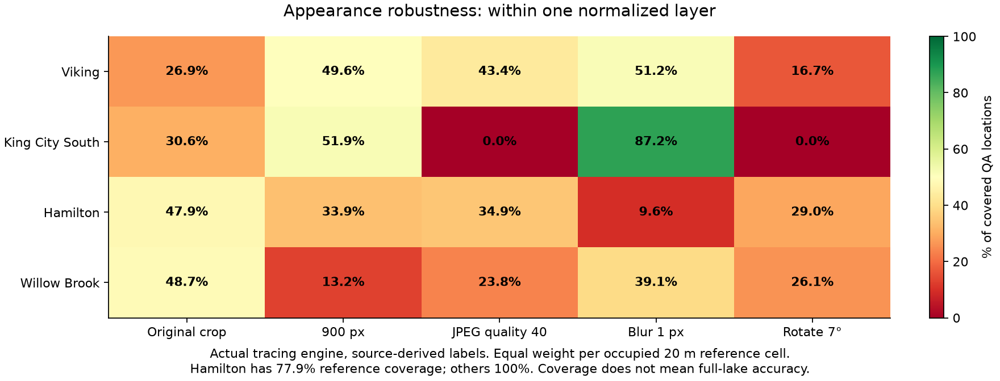
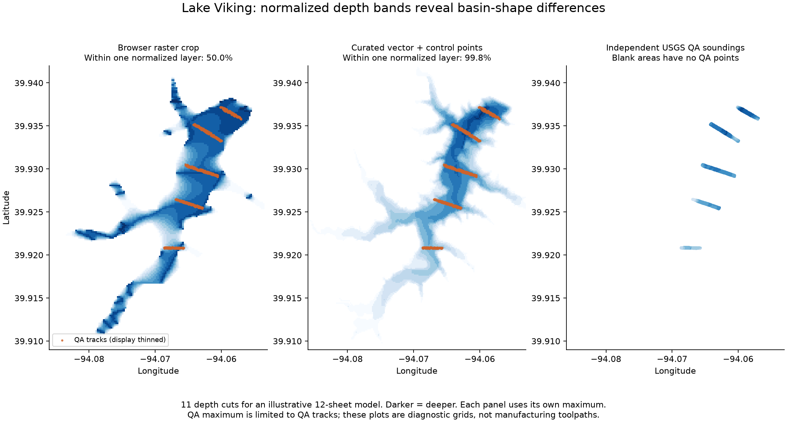
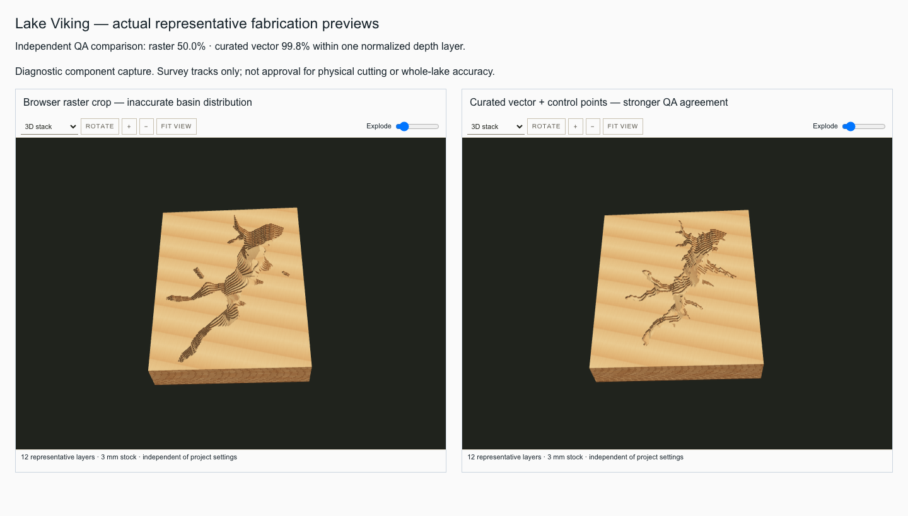

# Broad chart tracing accuracy — 2026-09-23

**Verdict: broad raster tracing accuracy fails this real-data check, including when fabrication appearance takes priority over absolute depth.** Successful import, contour coverage, and `publishable: true` are not evidence of a faithful basin. The existing curated Viking vector import performs substantially better on the independent survey tracks, but this is one bounded example, not system-wide certification.

## Scope and evidence

Evaluated 170,163 publisher-designated QA soundings across four USGS Missouri lake charts: Viking, King City South, Hamilton, and Willow Brook. The reference points occupy 358 distinct 20 m cells across the four lakes. Tested 20 image variants (four lakes × original crop, 900 px, JPEG quality 40, Gaussian blur 1 px, and 7° rotation), plus four earlier full-PDF/cropped browser results and the existing curated Viking vector record: **25 comparisons**.

All 20 engine trials returned records, and all reported `publishable: true`. The saved harness reproduced all 25 scores exactly after rerendering the pinned PDFs and rerunning the 20 variants. Four independent evaluator tests passed. No acceptance threshold was retrofitted to call these results a pass.

The 20 variants directly call the production `buildChartFromImage` engine with source-derived marks transformed with the image. They do not repeat the full browser interaction. The four browser baselines do exercise the real upload/mark/worker flow from the earlier stress test. Different raster sizes and label placement paths explain why engine “original” and browser “crop” are separate cases; they must not be conflated.

## Appearance result

For an illustrative 12-sheet model, compare 11 normalized depth cuts at surveyed locations. Normalize the trace by its grid maximum and the reference by its maximum QA depth. This deliberately gives a uniform depth-scale error a chance to disappear. Remaining differences indicate misplaced or distorted depth distribution relative to the reference, although this metric also depends on the two maxima. It is a diagnostic of appearance, not an exact count of incorrect manufacturing layers.

The Viking browser crop is within one normalized sheet at only **50.0%** of spatially weighted covered reference locations; its 95th-percentile difference is **four sheets**. King City's browser crop reaches **79.5%**, with a two-sheet 95th-percentile difference. The curated Viking vector record reaches **99.8%**, with a one-sheet 95th-percentile difference.

The King City JPEG and rotated engine variants have **0%** within one normalized sheet. Hamilton has only **77.9%** reference coverage in every variant; reporting appearance only at covered locations must not hide that missing coverage. None of the 20 engine variants exceeds 87.2% within one normalized sheet. Even this favorable source-label placement does not establish robust raster tracing.

These are diagnostic depth-grid plots, not app screenshots or final toolpaths. Orange locations show independent QA tracks, thinned only for display. The right panel contains measured points only; blank regions are not interpolated into invented truth. Matching geographic axes expose footprint differences between the raster and curated vector workflows. The vector result should not be treated as ground truth away from the tracks.

The screenshot above mounts the application's actual `ChartDepth3D` components with their normal preview styles in an explicitly labeled diagnostic comparison. Both geometries contain 12 representative sheets; neither renderer reported unavailability. The raster preview has up to 30 material polygons on a sheet versus 21 for the vector example. These counts describe these outputs only and do not by themselves prove fragmentation or cutting suitability. The capture is separate from the earlier full UI workflow tests.

## Measured results

Each occupied 20 m reference cell has equal total weight. Appearance percentages are conditional on available predictions; reference coverage is shown separately. Absolute errors compare bed elevations in a consistent vertical datum, expressed as equivalent depth error. P95 is the weighted 95th percentile.

| Trial | Reference coverage | Median error (m) | P95 error (m) | Within one normalized sheet | P95 sheet difference |
| --- | ---: | ---: | ---: | ---: | ---: |
| viking-pdf | 100.0% | 9.75 | 14.01 | 31.7% | 7 |
| viking-crop | 100.0% | 2.06 | 6.67 | 50.0% | 4 |
| king-city-pdf | 100.0% | 1.20 | 2.19 | 56.9% | 4 |
| king-city-crop | 100.0% | 0.27 | 1.17 | 79.5% | 2 |
| viking-curated-vector | 100.0% | 0.24 | 0.93 | 99.8% | 1 |
| hamilton-original | 77.9% | 0.94 | 3.28 | 47.9% | 5 |
| hamilton-low-resolution | 77.9% | 2.85 | 4.62 | 33.9% | 6 |
| hamilton-jpeg-40 | 77.9% | 1.10 | 3.64 | 34.9% | 5 |
| hamilton-blur-1px | 77.9% | 1.93 | 3.01 | 9.6% | 6 |
| hamilton-rotated-7deg | 77.9% | 0.97 | 3.01 | 29.0% | 4 |
| willow-original | 100.0% | 0.97 | 3.22 | 48.7% | 6 |
| willow-low-resolution | 100.0% | 3.52 | 4.36 | 13.2% | 6 |
| willow-jpeg-40 | 100.0% | 1.67 | 3.55 | 23.8% | 7 |
| willow-blur-1px | 100.0% | 1.03 | 2.30 | 39.1% | 4 |
| willow-rotated-7deg | 100.0% | 3.22 | 3.74 | 26.1% | 5 |
| viking-original | 100.0% | 10.73 | 16.50 | 26.9% | 6 |
| viking-low-resolution | 100.0% | 2.40 | 7.06 | 49.6% | 4 |
| viking-jpeg-40 | 100.0% | 5.19 | 10.11 | 43.4% | 4 |
| viking-blur-1px | 100.0% | 2.74 | 8.00 | 51.2% | 5 |
| viking-rotated-7deg | 100.0% | 6.03 | 9.55 | 16.7% | 5 |
| king-city-original | 100.0% | 2.71 | 3.97 | 30.6% | 5 |
| king-city-low-resolution | 100.0% | 2.29 | 3.77 | 51.9% | 4 |
| king-city-jpeg-40 | 100.0% | 2.76 | 3.98 | 0.0% | 9 |
| king-city-blur-1px | 100.0% | 0.19 | 1.32 | 87.2% | 3 |
| king-city-rotated-7deg | 100.0% | 2.76 | 3.98 | 0.0% | 8 |

## Independent reference and limitations

The [USGS atlas](https://pubs.usgs.gov/publication/sim3486/full) and [associated data release](https://doi.org/10.5066/P92M53NJ) supply the chart contours and separately collected bathymetric QA data. The raw QA attribute `QA == 1` identifies points used by the publisher to evaluate gridded bathymetric elevations. Those points were reserved for this evaluation; their elevations were not used to select contour values, fit traces, tune thresholds, or generate variants. They are independent of this tracing pipeline, not an unrelated survey campaign with entirely independent systematic errors.

| Lake | QA points | Occupied 20 m cells | Public reference |
| --- | ---: | ---: | --- |
| Hamilton Reservoir | 33,364 | 44 | [USGS data](https://www.sciencebase.gov/catalog/item/5f6b8fc282ce38aaa24541e1) · [chart](https://pubs.usgs.gov/sim/3486/sim3486_sheet01.pdf) |
| Willow Brook Lake | 58,397 | 69 | [USGS data](https://www.sciencebase.gov/catalog/item/5f6ba15c82ce38aaa2455fb9) · [chart](https://pubs.usgs.gov/sim/3486/sim3486_sheet03.pdf) |
| Lake Viking | 52,620 | 224 | [USGS data](https://www.sciencebase.gov/catalog/item/5f6cb4c382ce38aaa2476366) · [chart](https://pubs.usgs.gov/sim/3486/sim3486_sheet07.pdf) |
| King City South Lake | 25,782 | 21 | [USGS data](https://www.sciencebase.gov/catalog/item/5f6b9ce482ce38aaa24556f7) · [chart](https://pubs.usgs.gov/sim/3486/sim3486_sheet02.pdf) |

Horizontal coordinates use the supplied NAD83(2011) UTM zone 15N PRJ and are transformed to longitude/latitude. QA elevations are NAVD88 feet using GEOID12b. Evaluation uses `chart surface elevation − QA bed elevation × 0.3048`, equivalent to comparing bed elevations. King City's catalog narrative gives a different water-surface elevation from its published chart; the calculation uses the chart record's surface (1,028.5 ft), avoiding an unrelated water-level offset.

The sampler uses grid pixel centers and bilinear interpolation, matching the application's depth sampling convention. Positive-weight missing neighbors invalidate a prediction; zero-weight missing neighbors do not. Reference cells include missing predictions in coverage. Dense sonar soundings are not 170,163 independent spatial trials: cell weighting reduces this imbalance, and the table reports the actual occupied-cell counts. No confidence intervals or whole-lake coverage claims are inferred from these transects.

These four lakes come from one publisher/atlas and use elevation contours. They broaden morphology and image-condition coverage, but do not cover every chart style, depth-label convention, scan damage, rotation, island topology, or manual marking error. The earlier Walden workflow uses depth labels, but no independent spatial reference was obtained here, so its apparent basins remain unvalidated. A 100% QA prediction coverage means every reference location has a prediction, not that every part of the lake is correct.

Appearance normalization uses the deepest QA sounding, which may miss the lake's true maximum; it is not full-surface contour overlap. Shoreline position, basin topology, layer continuity, minimum feature widths, kerf, and actual cut/assembly behavior still require separate checks. This work does not approve physical fabrication, including for Viking's better vector result.

## Documentation and next acceptance work

Keep the earlier [app captures](../images/real-depth-charts/README.md) labeled as workflow/diagnostic evidence. They are not approved examples of accurate fabrication. The two new figures are suitable for explaining observed failures and the bounded vector comparison, with the captions above. They have not been promoted into public guide pages.

Before presenting raster tracing as broadly accurate, investigate shoreline registration and contour-to-depth assignment using these reproducible counterexamples. Evaluate those stages separately: the present end-to-end scores cannot uniquely attribute the error to either one. Re-run unchanged source fixtures after fixes, inspect normalized basins and sheet continuity, then check actual output geometry and a representative physical cut. A successful record or a `publishable` flag alone is insufficient.

Artifacts: [all measurements](chart-tracing-accuracy-2026-09-23.json), [trace diagnostics and reproducibility receipt](chart-tracing-accuracy-receipt-2026-09-23.json), [pinned source manifest](../../scripts/verify/chart-accuracy/sources.json), and [reproduction instructions](../../scripts/verify/chart-accuracy/README.md). Raw downloads and generated records remain in ignored `.topostack/chart-accuracy/`. USGS-authored charts and soundings are public-domain material; source map-outline attribution is retained in the fixture provenance.
